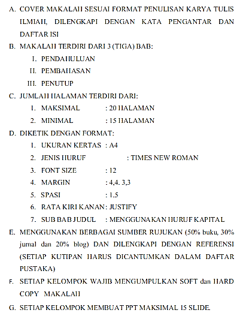
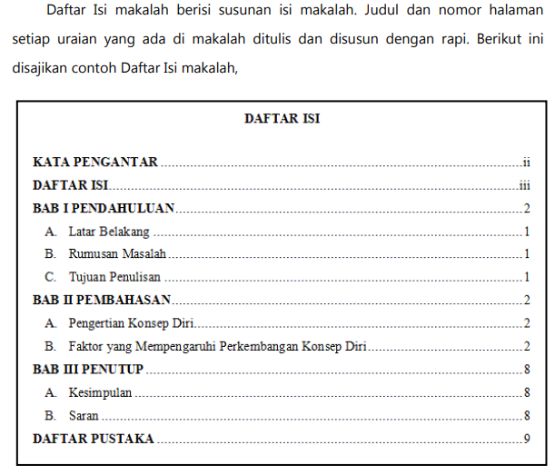
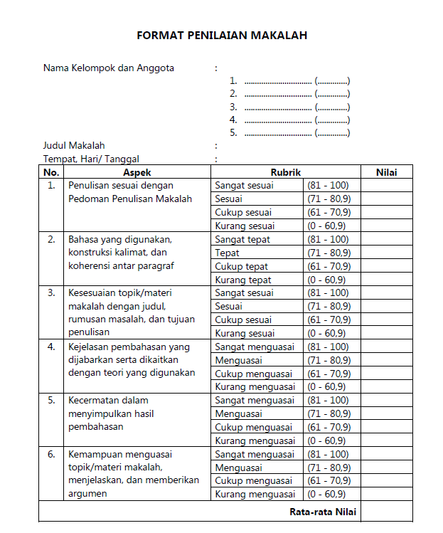

FORMAT PENYUSUNAN MAKALAH PROJEK P5 SMA NEGERI 12 BEKASI TP. 2023/2024

**FORMAT JUDUL MAKALAH**

APLIKASI “A” UNTUK MENINGKATKAN “B” PESERTA DIDIK KELAS “C” DI SMA NEGERI 12 BEKASI

A = KEGIATAN SESUAI TEMA

CONTOH : BUDAYA PALANG PINTU

KEGIATAN PEMBUATAN BATIK TULIS

KEGIATAN PEMBUATAN VACUM CLEANER SEDERHANA

GAYA HIDUP SEHAT ANTI COVID 19

B = SALAH SATU DIMENSI PROFIL PELAJAR PANCASILA

CONTOH : BERTAKWA KEPADA TUHAN GOTONG ROYONG

BERKEBHINEKAAN GLOBAL KREATIF

BERNALAR KRITIS MANDIRI

C = IDENTITAS KELAS CONTOH : X-1 XI-2 DSB

